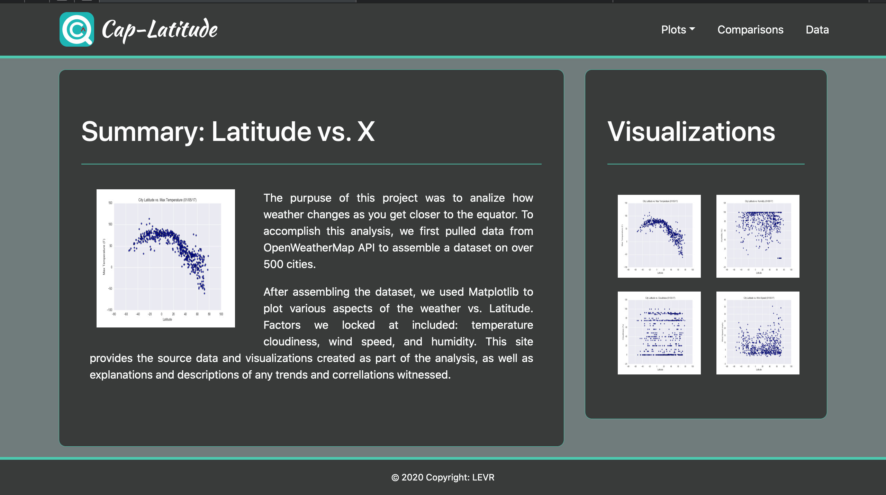

# Web-Visualization-Dashboard

  

Data is more powerful when we share it with others, for that in this project a dashboard was created to visualizate with Longitud - Latitude Analysis.These web pages contain the visualizations plots and their corresponding explanations

The landing page have a comparison of all of the plots, and another page where people can view the data used to build them.

### Tools

The following tools were used to develop the web page.

+ HTML
+ CSS
+ Bootstrap

  

